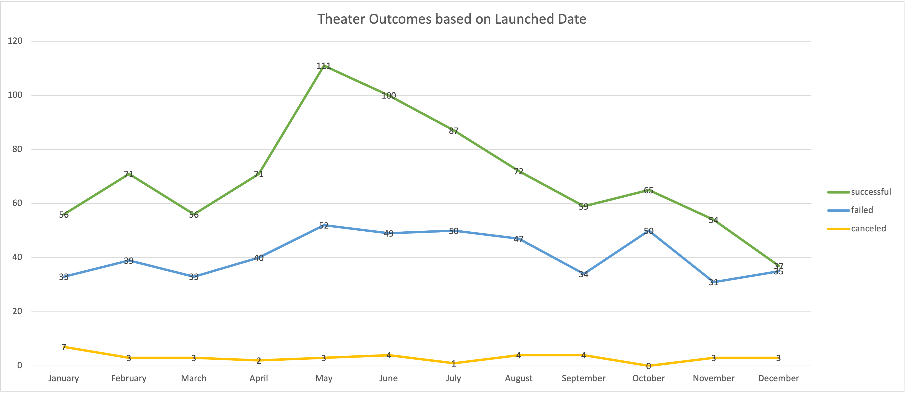

# Understanding the Kickstarter Data

## Overview of Project

### Purpose

The purpose of this analysis is to understand the Kickstarter data. This analysis especially focuses on the 'Theaters' category's subcategory called 'Plays'. Looking at the charts and tables, we can understand at any given launch month of a specific year, if the campaign met its goal for Theater. We will look at, in details, for each goal that the campaign set in theater, what are the success, failure and cancel rate for Plays. 

## Analysis and Challenges

### Analysis of Outcomes Based on Launch Date

Here we will closely look at the outcomes of theater for a given month and a specific year.

At any given month, from the pivot table it is clear that for theater, more goals have been successfully met than failed to meet. In fact up until 2013 there has been no cancellation or failure to meet goals. Starting 2014, there has been some cancelation and failures, however the rate of success has always been higher. This is also very prominent in the line chart below. 

### Analysis of Outcomes Based on Goals

Looking deeper into the campaign especially for plays, there hasn't been any cancelations at all. Goals set under $15000, were met with a higher percentage of success than failure. For goal set $25000 to $35000, and above $45000, the percentage of failure was much higher than success for plays. 

### Challenges and Difficulties Encountered

The initial challenge that I faced while looking at the data was that the deadline and the launch date provided was not formatted. At the beginning, the deadline and launch date contained Unix timestamps that needed to be converted to readable data. Using an excel formula I was able to convert the Unix timestamps into formatted dates.

A possible future challenge would be when we insert new data or replace existing data, we will have to make sure, the newly added fields will also be updated, for example, formatted launch date, Category, Subcategory etc.

## Results

### What are two conclusions you can draw about the Outcomes based on Launch Date?

The two conclusions based on the outcomes of launch date that I have arrived at, are:

- The month of May and June have a higher success  rate for theaters. This is probably because that’s when people usually have summer vacation and they can actually go to theaters more often. Days are also longer during summer, giving people more opportunities to go to theaters.

- Something triggered the start of failure and cancellation from the year 2014. After 2014, even though success rate has always been higher than failure or cancellation, before 2014, there was no failure to meet goals or any cancellations at all.

### What can you conclude about the Outcomes based on Goals?

In my opinion, goals for plays should be set only up till $15000 in order to achieve a higher success rate of meeting pledged goals. 

### What are some limitations of this dataset?

This data is not considering factors such as inflation, location, detailed description of plays.

- Inflation: Inflation is important to be included to understand the value set by goals and the pledges met.

- Location: We have to consider where for example, the theater is actually located. If the theater is located in a densely populated area the chances of getting more audience is higher then if the theater was located in a less populated area.

- Detailed description of Plays: More audience will come to watch a play with good artists, popular director and a good story line. Thus the success rate of such a play will be higher than another play. 

### What are some other possible tables and/or graphs that we could create?

A table should be made to reflect the success, failure and cancellation of theater and plays based on each country. This would tell us in which country plays are more popular which would help us to set more realistic goals.

Also it would be better to create a graph that shows success, failed, cancelled results for each year instead. That will tell us how the campaign of theaters has grown over the years. 

Data is needed to show more details about the plays. A success of a play for example, depends on the artists, the rating of the play, and the director of the play. A play that has popular or better artists with a good director will probably attract more audience then other plays.

